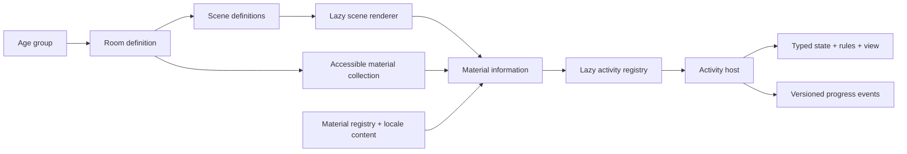

# Montessori Virtual Room — foundation architecture

## Repository assessment

The initial workspace contained no application files, dependencies, reusable components, assets, or AGENTS.md instructions. The `.git` directory was a protected placeholder, not an initialized Git repository. No existing application conventions needed preservation.

## Stack and boundaries

Use a client-rendered React + TypeScript application built with Vite. Server rendering and a backend are unnecessary for the first local exploration prototype. React Three Fiber renders the room; Drei supplies constrained orbit controls and small scene utilities. React state and reducers cover current navigation and activity state without an additional store. React is constrained to 19.2 to match Fiber's declared peer compatibility. See [Fiber installation guidance](https://r3f.docs.pmnd.rs/getting-started/installation).

The room is an exploration layer. Selecting a registered material opens accessible HTML information; selecting an available activity mounts a separate focused view. Room geometry and activity rules have no dependencies on each other. Activities use focused work surfaces with optional 2D and 3D renderers sharing one state model. Pink Tower is a placement study, not a rigid-body simulation. Mouse, keyboard, and touch use the same select-then-place workflow.



## Directory structure

```text
src/
  App.tsx                       Navigation and current-session state
  domain/
    material.ts                 Material, content, age, area, asset, room contracts
    activity.ts                 Generic module interface and lifecycle events
  content/
    materials.ts                Locale-independent material and placement registry
    en/materials.ts             Editorial content, with explicit review status
  room/
    RoomRenderer.tsx            Typed lazy renderer dispatch
    RoomStage.tsx               Shared camera, lighting, controls, and fallback
    RoomObjects.tsx             Reusable shell, hotspots, and geometry
    ChildrenHouseScene.tsx      3–6 whole-classroom view
    PracticalLifeScene.tsx      Focused 3–6 Practical Life view
    SensorialScene.tsx          Focused 3–6 Sensorial view
    LanguageScene.tsx           Focused 3–6 Language view
    MathematicsScene.tsx        Focused 3–6 Mathematics view
    ToddlerRoomScene.tsx        Distinct 18-month–3-year environment
  components/
    MaterialArt.tsx             Lightweight SVG collection illustrations
    MaterialPanel.tsx           Native dialog and separate adult information
  activities/
    registry.tsx                Lazy module launchers
    ActivityHost.tsx            Reset, guidance, exit, completion, progress
    pink-tower/
      model.ts                  Pure typed state transitions and completion rules
      model.test.ts             Behavioral tests
    cylinder-blocks/             Graduated width fitting
    color-tablets/               Reversible visible matching
    dressing-frame/              Button and fabric sequencing
    pouring/                    Bounded volume transfer and cleanup
    materials.test.ts           Cross-module behavioral tests
      index.tsx                 Specialized activity view and module definition
  styles.css                    Responsive visual system and motion preferences
public/assets/materials/        Future versioned GLB, images, narration
```

Future rooms belong in `content/rooms/`; additional locale directories mirror `content/en/`. Introduce locale loading and a UI string catalog before shipping a second language. IDs remain locale-independent. Do not infer that all materials suit all children within an age range.

## Data and module contracts

`Material` contains stable ID, area, recommended age in months, activity ID, interaction category, and replaceable asset reference. `MaterialContent` contains display name, description, purpose, aims, skills, presentation, control of error, prerequisites, related materials, next work, adult note, review state, source URLs, and optional narration with transcript. The content record is typed separately and can later be generated from validated JSON or a CMS.

`RoomDefinition` owns an age environment and a list of `RoomSceneDefinition` views. Each scene selects a typed renderer and declares its material placements, including shelf, position, rotation, and label height. The UI resolves the configured default scene, so adding a focused view does not duplicate material cards or activities. `materialsForRoom` returns the unique materials across every scene in first-placement order.

`RoomRenderer` lazy-loads the configured scene component. `RoomStage` supplies the shared WebGL canvas, camera, restrained orbit controls, lighting, shadows, and HTML fallback. `PreparedRoomShell` and `MaterialHotspot` share room geometry and pointer behavior while each scene retains its own layout. A future material model renderer should dispatch using `assets.modelKey` or `assets.url`; the current procedural renderer switches on material ID. Room and asset scaling use a common meter-like coordinate system. Future model manifests should define authored scale, origin, orientation, and bounds.

`ActivityDefinition<State, Action>` declares ID, version, required assets, initial state factory, pure reducer, completion predicate, guidance text, and a specialized React view plus an optional lazy `View3D`. A lazy launcher closes over each concrete state/action pair, preserving type safety without a universal action union or `any` state store. The host supplies reset, optional guidance, completion announcements, exit, and versioned lifecycle events. Views handle material-specific interaction. Add validation/preloading for `requiredAssets` when the first external asset ships; it is empty in the reference implementation.

Progress events are held in a bounded in-memory session buffer. No child account, analytics, remote writes, or persistent history exist yet. Later add an opt-in storage adapter, schema migration, and clear-history control. Completion indicates the simulation's condition, not mastery or a developmental assessment.

## Assets and educational content

The initial room uses procedural low-poly geometry, no image generation, external 3D models, or large textures. Cards use code-native SVG illustrations. Fonts use a Google Fonts stylesheet with local system fallbacks; self-host licensed fonts before an offline or school deployment.

Future assets should live at `public/assets/materials/<material-id>/<version>/`, referenced by a manifest, never embedded in rules. Prefer optimized GLB with Meshopt/Draco where measured beneficial, KTX2 textures when needed, small thumbnails, and audio with plain transcripts. Include source, license, author, scale, byte size, and revision metadata. Load only the current room and selected activity; use content-hashed immutable URLs and browser caching. Measure actual tablet memory and decode performance before adding compression complexity.

Content in `src/content/en/materials.ts` is a prototype editorial draft, not reviewed Montessori guidance. Source lists are intentionally empty pending verified educator-reviewed references. Every panel exposes that status in the adult layer. An educator should review age/readiness, terminology, presentation sequence, aims, control of error, and suggested follow-on work. Each approved revision should retain reviewer and review date metadata. Audio must read the reviewed content and retain its transcript. The current UI is English only.

## Major risks and mitigations

| Risk                                                          | Foundation response                                                                         | Required follow-up                                                             |
| ------------------------------------------------------------- | ------------------------------------------------------------------------------------------- | ------------------------------------------------------------------------------ |
| Digital work loses weight, texture, grip, and social modeling | Adult notes explain the limitation; no mastery claims                                       | Educator and supervised learner review                                         |
| Touch placement differs from mouse precision                  | Select then tap; generous controls; no drag-only tasks                                      | Real iPad/Android tablet testing and motor accessibility study                 |
| Poor GPU or WebGL failure                                     | Lazy scene, capped pixel ratio, demand rendering, HTML material cards and renderer fallback | Measure GPU/memory budgets; context-loss recovery and low-detail option        |
| 100+ modules bloat initial download                           | Lazy activity launchers and independent reducers                                            | Per-room data loading, bundle budgets, asset eviction strategy                 |
| A generic engine suppresses distinct material behavior        | Shared lifecycle, module-owned actions and views                                            | Validate the interface with fitting and pouring next                           |
| Educational drift or inaccurate sequencing                    | Content separated with draft/review field                                                   | Verified citations, qualified review, locale review workflow                   |
| Room geometry becomes hard to maintain                        | Data-driven material placement, procedural shapes                                           | Split furniture/model renderer into reusable components as rooms grow          |
| Completion becomes an artificial reward                       | Quiet status message; wrong layouts remain editable                                         | Observe whether children can understand control of error without added prompts |

Pink Tower currently checks ten unique cubes in descending order and horizontal centering within an 8-pixel tolerance. It permits wrong order and offsets. It offers removal of the top cube, reset, optional guidance, and completion. The 3D renderer adds orbitable cubes and direct raycast selection/placement. It does not simulate falling, free dragging, carrying cubes, returning all cubes to a shelf, or alignment in depth. The traditional real-world presentation is distinct from these prototype interactions.

Accessibility includes HTML material access, native modal focus behavior, semantic buttons, visible focus, keyboard cube placement, a polite completion status, touch-friendly activity targets, and reduced-motion styles. Room camera exploration itself uses pointer gestures; keyboard users access identical material information through the collection. This is a baseline, not a formal WCAG audit.

## MVP implementation sequence

1. **Foundation — implemented:** Vite/React/TypeScript, two enabled age environments, data-driven scene definitions, seven area filters, 22 registered materials, constrained room orbit/zoom, accessible material collection.
2. **Information — implemented as drafts:** selection dialog, purpose/aims/presentation, narration with transcripts, adult layer, review state, all 22 activities available.
3. **Activity framework — implemented:** typed module contract, lazy launch, host lifecycle, reset, guidance, completion, session events.
4. **Pink Tower reference — initial study implemented:** select/place ten cubes, order and horizontal alignment detection, reversible errors, completion and model tests. Next validate interaction with an educator and tablet users.
5. **Other four activities — initial simulations implemented:** Cylinder Blocks (lift ten cylinders and compare socket widths; an incorrect fit stays visibly above the socket), Color Tablets (three visible color pairs; mismatched pairs may be separated), Dressing Frame (unbutton/open/join/button sequence), Pouring (pickup, positioning, tilt-controlled bounded water transfer, upright/return, spill cleanup). Each module owns its reducer and view and uses the shared reset/guidance/completion lifecycle. These are simplified digital studies pending educator and learner validation.
6. **Refinement — baseline begun:** real-device touch testing, keyboard/screen-reader review, loading/error recovery, frame-time and memory profiling, animation respecting reduced motion, educator content review.
7. **Persistence and adult functionality — planned:** optional local progress with schema versions, reviewed adult resources, localization, additional rooms. A backend is a separate product decision.

The prototype now establishes a path from room exploration to 20 accessible interactive materials across six age environments. Twenty is the current release scope; further additions are deferred until educator feedback. Withdrawn drafts do not count as available activities. Content review, real-device evaluation, and refinement remain before treating it as a finished educational resource.

## Additional activity semantics

- **Cylinder Blocks:** Ten cylinders vary in diameter with equal modeled height, representing one dimension of cylinder-block work. All ten must have been lifted at least once and returned to their correct sockets to complete. Mismatched trials remain selected and visibly raised; no punitive signal appears. The model does not simulate a too-small cylinder falling into a socket.
- **Color Tablets:** The first matching study uses three paired colors. Both identical and mismatched pairs remain visible. Separating a pair returns both tablets to the tray. Screen-reader labels include color names; this makes the activity accessible through an alternate verbal matching route. Screens do not reproduce calibrated real tablet colors.
- **Dressing Frame:** Completion requires opening all four buttons, separating the fabric, joining it, and fastening every button. Buttons are disabled while the fabric is separated. This models sequence and coordination choices, not the fine motor resistance of real fabric.
- **Pouring:** The reducer conserves source + receiving + spilled + wiped water. Tilt above 25 degrees transfers water at a rate proportional to tilt, using elapsed steps capped at 250 ms. A hidden document does not advance flow; leaving the activity clears the interval. The pitcher must be upright to reposition or return. Completion requires emptying the pitcher, transferring some water to the cup, returning the pitcher, and cleaning spills. Spilling all the water requires starting again. Percentages are vessel-level observations, not scores. Fluid geometry is illustrative rather than physically simulated.

Activity families are lazy-loaded. The shared Three.js/Fiber/Drei chunk is approximately 880 kB minified (237 kB gzipped), with separate small scene and activity chunks; Vite reports a size warning. It is separate from the initial HTML UI bundle. Actual tablet GPU and loading performance remain to be profiled. No large textures or models are loaded.

## Optional 3D activity views

Each activity definition exposes a lazy `View3D` with the same `ActivityViewProps<State, Action>` contract as its 2D view. `ActivityHost` owns the view switch and keeps the reducer mounted, so switching changes only the presentation. Completion, selection, reset, guidance, and lifecycle events are shared; changing view does not create a new attempt. The 2D view remains the initial default.

`activities/shared/ActivityStage.tsx` provides capped pixel ratio, demand rendering, warm lighting, orbit/zoom, a camera reset, and an error/WebGL fallback explaining how to return to 2D. Each material owns its meshes and maps raycast clicks to existing actions. Pointer motion beyond a small threshold is treated as camera movement rather than a selection. Equivalent HTML controls remain below each canvas (cylinder controls are expandable).

The Pink Tower uses physically graduated cube geometry and converts horizontal world coordinates to the existing alignment units. Cylinder Blocks uses an extruded board with actual circular holes. Color Tablets uses rectangular wooden tablets with colored surfaces. Dressing Frame uses separate fabric panels and selectable buttons. Pouring uses hollow lathed vessels, an illustrative water volume, and a connected stream, reusing the same controls and ticking hook in both views. Water is simplified, not a fluid solver, and fabric is not a cloth simulation. The host preserves state when either renderer unmounts.

The optional `scripts/browser-3d-check.py` verifies mesh picking for the original five 3–6 activities. `scripts/browser-new-activities-check.py` completes the ordered materials, checks their 2D/3D continuity and HTML alternatives, and exercises Sandpaper Letters with keyboard and pointer input. Real hardware and assistive-technology review remain separate validation tasks.

## Subsequent room and guidance additions

The prototype now has a distinct Toddler Community for 18 months–3 years in `room/ToddlerRoomScene.tsx`, with its own furniture layout, movement rug, low mirror, reading nook, low table, and practical-care area. The 3–6 Children’s House includes focused Practical Life, Sensorial, Language, and Mathematics views with their own compositions. Every view uses the same material and activity records. `RoomObjects.tsx` shares only reusable geometry and interaction primitives. `materialsForRoom` scopes the collection to an age environment. The toddler collection adds Bowl Transferring and Three-Shape Puzzle, and shares readiness-led Pouring.

`ActivityDefinition.demonstration` optionally loads a data-driven virtual solution. The player interpolates authored object poses, with an arc for lifting and placing, step captions, pause/replay, manual next-step, and reduced-motion behavior. Demonstrations run in an isolated native dialog and receive no learner-state dispatch. The learner's renderer is unmounted during demonstration, stopping its view effects, while its reducer remains in the activity host. Closing the example resumes the untouched state. These demonstrations are marked as drafts of the virtual exercise rather than full Montessori presentations.
